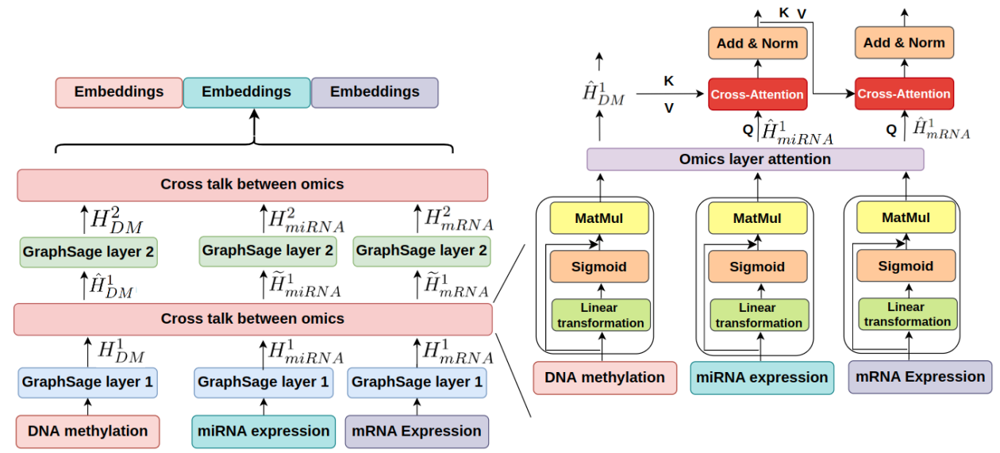

# MultiGEOmics
MultiGEOmics: Graph-Based Integration of Multi-Omics via Biological
Information Flows

### This repository is our PyTorch implementation of MultiGEOmics.

<p align="center">
  
</p>

We compare MultiGEOmics with two sets of SOTA models. main_1.py from IGCN paper to run on ADNI, ROSMAP, TCGA_BRCA, TCGA_GBM datasets and main_2.py from DeepKEGG paper to run on AML, BLCA, BRCA, LIHC, PRAD, WT datasets. All the datasets have been collected from these two papers. 


### Create and activate environment
```shell script
conda create -p ./mulgeoenv python=3.8.10 -y
conda activate ./mulgeoenv
```


### Install dependencies 
```shell script
pip install torch==2.2.0 torchvision torchaudio --index-url https://download.pytorch.org/whl/cu118
pip install torch-scatter -f https://data.pyg.org/whl/torch-2.2.0+cu118.html
pip install torch-sparse -f https://data.pyg.org/whl/torch-2.2.0+cu118.html
pip install dgl-cu117 -f https://data.dgl.ai/wheels/repo.html
pip install -r req.txt
```


## How to run MultiGEOmics
### 1. Dataset Location
Place all input files in the dataset/ directory.
### 2. Supported File Formats
The current implementation supports input files in .csv or .pkl format.

Option 1: CSV Format

```text
dataset/
└── TCGA_BRCA/
    ├── meth.csv
    ├── mirna.csv
    ├── expression.csv
    └── labels.csv
```
Option 2: Pickle Format 

```text
dataset/
└── TCGA_GBM/
    ├── mirna.pkl
    ├── expression.pkl
    └── labels.pkl
```
### 3. File Naming Convention and Omics Order
The dataset files must be named based on the omics types, and their names (excluding file extensions) should exactly match the entries in `model_config.py`.  Here are some example dataset configurations:
```text
TCGA_BRCA = ["meth", "mirna", "expression"]
```
This represents the flow of data types from meth (methylation) to mirna (miRNA) and then to expression (mRNA).

### To run the code
```shell script
 python main_run.py --dataset=TCGA_GBM --epochs=450 --early_stopping=150
```
In the examples above, `TCGA_GBM` refers to the name of the dataset (`dataset/TCGA_GBM/`).


